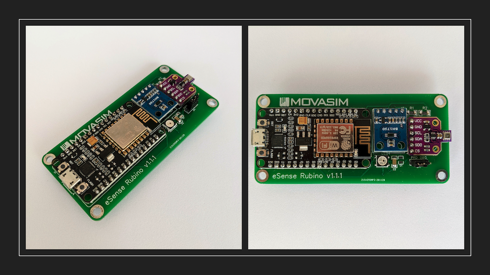

# eSense Rubino
### Environmental Sensing Device based on Espressif ESP8266, Bosch BME680 and ROHM BH1750.

**eSense** **Rubino** has been designed to work with the **IoTek-enviro** service provided by [MOVASIM](http://movasim.com/). This service focuses on monitoring human well-being conditions for several scenarios *(for instance offices, buildings, factories, senior living, universities and schools).* 

**eSense Rubino** is mainly used for testing, demos and small deployments where no industrial devices are requiered. We published it under the Open Source Hardware and Software licenses, so anybody can build it and test **IoTek-enviro** service. Whith this purpose, **eSense Rubino** could be mounted on a [protoboard](#Protoboard-Assembly), on a [PCB](#eSense-Rubino-Schematic-PCB-BOM-and-Power-Supply-specs), or get completely [assembled by us](mailto:info@movasim.com).

**eSense Rubino** measures **Air Quality**, Ambient **Lighting**, **Temperature**,   **Humidity** and  **Pressure**. It uses WiFi as communication channel, making it convenient for most indoor installations.

## Feature Description

**Indoor Air Quality or “IAQ”** is a term that refers to the quality of the air in and around buildings and structures, especially as it relates to the health and comfort of its occupants. Indoor air quality can be affected by gases, *(including carbon monoxide, radon, volatile organic compounds)*, particulate matter, contaminating microbes *(mold, bacteria)* or any material that can induce adverse conditions for the Health. 

**eSense Rubino** includes [Bosch's BME680 Gas Sensor](#Bosch-BME680-Sensor), allowing the device to detect a broad range of gases to measure indoor air quality for personal well being. Gases that can be detected include: Volatile Organic Compounds *(VOC)* from paints *(such as formaldehyde)*, lacquers, paint strippers, cleaning supplies, furnishings, office equipment, glues, adhesives and alcohol.

Based on [Bosch's BSEC Library algorithm](https://github.com/BoschSensortec/BSEC-Arduino-library), the sensor provides an index for air quality *(IAQ)* output. In principle, this output is in an index that can have values between 0 and 500 with a resolution of 1 to indicate or quantify the quality of the air available in the surrounding. Detailed classification of  IAQ index provided by Bosch is described in the [Bosch BME680 Section](#Bosch-BME680-Sensor).

Based on IAQ Index, Color Coding is shown by eSense with a NeoPixel LED. Color coding can se seen below:

| IAQ.Index |     Air.Quality      | Color.Coding | Impact *(long exposure)*                                     | Suggested action                                             |
| :-------: | :------------------: | :----------: | :----------------------------------------------------------- | :----------------------------------------------------------- |
|   0-50    |      Excellent       |    Green     | Pure air; best for well being.                               | No measures needed.                                          |
|  51-100   |         Good         | Light-Green  | no irritation or impact on well being.                       | No measures needed.                                          |
|  101-150  |   Lightly polluted   |    Yellow    | reduction of well-being possible                             | Ventilation suggested.                                       |
|  151-200  | Moderatelly polluted |    Orange    | More significant irritation possible.                        | Increase ventilation with clean air.                         |
|  201-250  |   Heavily polluted   |     Red      | Exposition might lead to effects like  headache depending on type of VOCs. | optimize ventilation.                                        |
|  251-350  |  Severely polluted   |   Magenta    | More severe health issue possible if  harmful VOC present.   | Contamination should be identified if level is reached even  w/o presence of people; maximize  ventilation & reduce attendance. |
|   > 350   |  Extremely polluted  |     Pink     | Headaches, additional neurotoxic effects  possible.          | Contamination needs to be  identified; avoid presence in room  and maximize ventilation. |

 NeoPixel LED also indicates if the device is connected to the WiFi Network as well as if the Gas Sensor is in "Calibrating Mode". 

| Color.Coding | Meaning                                                      |
| :----------: | ------------------------------------------------------------ |
|    White     | The device is in WiFi Acces Point (AP) Mode or trying to connect to the WiFi network with the latest provided credentials. |
|     Blue     | The device is connected to the selected WiFi Network, and BME680 sensor is calibrating *(IAQ Accuracy = 0)*. See [BME680 Sensor](#Bosch-BME680-Sensor) for detailed information. |

**eSense Rubino** also integrates a Luxometer to measure ambient lighting quality, which is interpreted by **MOVASIM's IoTek-enviro** service based on [**European Standard EN 12464-1**](https://www.en-standard.eu/din-en-12464-1-light-and-lighting-lighting-of-work-places-part-1-indoor-work-places/?mena=8) to display the **Ambient Lighting Quality Indicator**. This standard highlights the minimum illuminance requirements of specific areas, as described in the following table:

| Area                              | Lux  |
| --------------------------------- | ---- |
| Office                            | 500  |
| Technical drawing                 | 750  |
| Footpaths                         | 100  |
| Average industrial work           | 300  |
| Refined industrial work           | 500  |
| Stairs, escalators and treadmills | 150  |
| Wardrobe                          | 200  |
| Classrooms                        | 500  |

**Temperature and relative humidity** affect the perception of comfort in an indoor environment.  The perception of thermal comfort is related to one’s metabolic heat  production, the transfer of heat to the environment, physiological  adjustments, and body temperature. Heat transfer from the body to the  environment is influenced by factors such as temperature, humidity, air  movement, personal activities, and clothing. The [ANSI/ASHRAE Standard 55-2013: Thermal Environmental Conditions for Human Occupancy](ANSI/ASHRAE Standard 55-2013: Thermal Environmental Conditions for Human Occupancy) specifies the combinations of indoor environmental and personal factors that produce acceptable thermal conditions to a majority of occupants  within a space. Assuming slow air movement *(less  than 40 feet per minute)* and 50% indoor relative humidity, the operative temperatures recommended by ASHRAE range from 68.5ºF to 75ºF in the winter, and from 75ºF to 80.5ºF in the summer. The difference in temperature ranges between the seasons is largely due to clothing selection. ASHRAE also recommends that  indoor relative humidity be maintained at or below 65%. [The U.S. Environmental Protection Agency *(EPA)*](https://www.epa.gov) recommends maintaining indoor relative humidity between 30 and 60% to reduce mold growth. 

enviroSense and MOVASIM's Platfom is uses the MQTT protocol to communicate with MOVASIM's Platform. Periodically, the device sends reports to the platfom with sensors information. For more technical information click on the specific enviroSense version.

## eSense Rubino Schematic, PCB, BOM and Power Supply specs

eSense Rubino Schematic and PCB design have been developed with [EasyEDA](https://easyeda.com) and [published here under CC-BY-SA-4.0 License](https://easyeda.com/gdidonato/esense-rubino). The latest Release is also available as a ZIP package in this Repository.

The PCB was designed in two layers for easy assembly. It has a Jumper *(JP1)* that switches the device from "Debug Mode" to "Production Mode". In "Debug Mode" useful information is printed to the device serial port, so when connected to a computer, tuning, troubleshhoting and debuging tasks can be performed.

### Bill of Materials

Below is the BOM for eSense Rubino PCB assembly. For Protoboard assembly, check the [Protoboard Assembly](#Protoboard-Assembly) section.

| ID   | Name          | Designator | Footprint               | Quantity |
| ---- | ------------- | ---------- | ----------------------- | -------- |
| 1    | CJMCU-680v2   | U3         | CJMCU-680               | 1        |
| 2    | JUMPER2       | JP1        | JUMPER2                 | 1        |
| 3    | WS2812S-W     | LED1       | LED-SMD_6P-L5.0-W5.0-TL | 1        |
| 4    | BH1750 GY-302 | U2         | BH1750 GY-302           | 1        |
| 5    | 0.1u          | C2         | C1206                   | 1        |
| 6    | 4K7           | R2,R1      | R1206                   | 2        |
| 7    | 0.1u          | C1         | C0805                   | 1        |
| 8    | NODEMCU 8266  | U1         | NODEMCU ESP8266         | 1        |

### Power Supply specifications

eSense Rubino could be powered with almost any Mobile Phone battery charger, as it only drains 100 mA CC. It uses the on-board MicroB USB connector provided by NodeMCU board. 

## Bosch BME680 Sensor

### Gas sensor measuring relative humidity, barometric pressure, ambient temperature and gas *(VOC)*.     		

According to [Bosch](https://community.bosch-sensortec.com/t5/Bosch-Sensortec-Community/ct-p/bst_community), BME680 is the first gas sensor that integrates high-linearity and high-accuracy gas, pressure, humidity and temperature sensors. 

It is  especially developed for applications where size  and low power consumption are critical requirements. In order to  measure air quality for personal wellbeing the gas sensor within the  BME680 can detect a broad range of gases such as volatile organic  compounds *(VOC)*.

**Main sensor characteristics:**

- Operating Voltage: 1.7V - 3.6V DC
- Communication interface: I2C or SPI
- Pressure Range: 300 to 1100 hPa
- Temperature range: -40 ° C to 85 ° C
- Humidity range: 0% to 100%
- Ultra-low power consumption

eSense Rubino uses Bosch's Sensortec library to get IAQ index based on its internal algorithm, providing an idea of the ambient air quality. Sensor output is as follows:

`RAW TEMPERATURE`
`RAW PRESSURE`
`RAW HUMIDITY`
`RAW GAS RESISTANCE`
`IAQ`
`STATIC IAQ`
`IAQ ACCURACY`
`CO2 EQUIVALENT`
`BREATH VOC EQUIVALENT`
`SENSOR HEAT COMPENSATED TEMPERATURE`
`SENSOR HEAT COMPENSATED HUMIDITY`

Atough eSense reports to IoTek-enviro all those parameters, in typical applications, sIAQ value along with its calculated derivations *(bVOCeq and CO2eq)* are monitored. Below are some details regarding those values:

- **Static IAQ:**
  - The main difference between IAQ and static IAQ *(sIAQ)* relies in the scaling factor calculated based on the recent sensor history. The sIAQ output has been optimized for stationary applications *(e.g. fixed indoor devices)* whereas the IAQ output is ideal for mobile application *(e.g. carry-on devices)*. 

- **bVOCeq estimate:**

  - The breath VOC equivalent output *(bVOCeq)* estimates the total VOC concentration [ppm] in the environment. It is calculated based on the sIAQ output and derived from lab tests.

- **CO2eq estimate:**
  - Estimates a CO2-equivalent *(CO2eq)* concentration [ppm] in the environment. It is also calculated based on the sIAQ output and derived from VOC measurements and correlation from field studies.

The CO2 and bVOC equivalent estimations, are derived from the sIAQ signal and provide an estimation of the gas concentration in ppm, making the assumption that the source of pollution is from human breath, and that the sensor is used indoors.

The IAQ accuracy is reflects the current state of the background sensor calibration process, such as:

- **IAQ Accuracy = 0** could either mean: 
  - BSEC was just started, and the sensor is stabilizing *(this lasts normally 5min in LP mode or 20min in ULP mode)*.
  - There was a timing violation *(i.e. BSEC was called too early or too late)*, which should be indicated by a warning/error flag by BSEC.
- **IAQ Accuracy = 1** means the background history of BSEC is uncertain. This typically means the gas sensor data was too stable for BSEC to clearly define its references.
- **IAQ Accuracy = 2** means BSEC found a new calibration data and is currently calibrating.
- **IAQ Accuracy = 3** means BSEC calibrated successfully.

IoTek-enviro service takes care of dealing with IAQ Accuracy parameter, showing in the Dashboard high-levell information for the end user.

## ROHM BH1750 Sensor

### Digital ambient light level sensor

The BH1750 Ambient Light Sensor Module  is based on the digital Ambient Light Sensor IC BH1750FVI developed by ROHM Semiconductor. It is a digital IC with built-in 16-bit illuminance  to digital converter. It gives measures directly in Lux.

Unlike other light level measurement systems, such as LDR resistors, the spectral response of the BH1750 is **designed to be similar to the human eye**.

**Main sensor characteristics:**

- Power Supply: 2.4V-3.6V *(typically 3.0V)*
- Current consumption: 0.12mA
- Wide measuring Range: 1-65535 Lux
- Communication: I2C bus
- Accuracy: +/-20%
- Built in A/D converter for converting analog illuminance in the digital data.
- Very small influence of IR radiation
- Highly responsive near to human eye.

Lux is the international system unit for illuminance. Illuminance is a measure of how much [luminous flux](https://en.wikipedia.org/wiki/Luminous_flux) is spread over a given area.  One can think of luminous flux *(measured in [lumens](https://en.wikipedia.org/wiki/Lumen_(unit)))* as a measure of the total "amount" of visible light present, and the  illuminance as a measure of the intensity of illumination on a surface. A given amount of light will illuminate a surface more dimly if it is  spread over a larger area, so illuminance is inversely proportional to  area when the luminous flux is held constant.

Following is a  chart from [Wikipedia](https://en.wikipedia.org/wiki/Lux) that provides some reference for the Lux unit.

| Illuminance (lux) | Surfaces illuminated by                        |
| ----------------- | ---------------------------------------------- |
| 0.0001            | Moonless, overcast night sky (starlight)       |
| 0.002             | Moonless clear night sky with airglow          |
| 0.05–0.3          | Full moon on a clear night                     |
| 3.4               | Dark limit of civil twilight under a clear sky |
| 20–50             | Public areas with dark surroundings            |
| 50                | Family living room lights                      |
| 80                | Office building hallway/toilet lighting        |
| 100               | Very dark overcast day                         |
| 150               | Train station platforms                        |
| 320–500           | Office lighting                                |
| 400               | Sunrise or sunset on a clear day               |
| 1000              | Overcast day, typical TV studio lighting       |
| 10,000–25,000     | Full daylight (not direct sun)                 |
| 32,000–100,000    | Direct sunlight                                |

The BH1750 has six different measurement modes which are divided in two groups; continuous and one-time measurements. In continuous mode the sensor continuously measures lightness value. In one-time mode, the sensor makes only one measurement and then goes into Power Down mode.

Each mode has three different precisions:

- Low Resolution Mode - *(4 lx precision, 16ms measurement time)*
- High Resolution Mode - *(1 lx precision, 120ms measurement time)*
- High Resolution Mode 2 - *(0.5 lx precision, 120ms measurement time)*

**eSense Rubino** uses [Christopher Laws](https://github.com/claws/BH1750) to manage BH1750 sensor. This library uses by defaul "Continuous High Resolution Mode.

The module that we use for eSense Rubino could be GY-30/GY-302, depending on market stock. Both modules are exactly the same from the poinout and characteristics point of view. They differ only in size.

**Connections:**

- **VCC** -> 5V (3V3 on Arduino Due, Zero, MKR1000, etc)

- **GND** -> GND

- **SCL** -> SCL (A5 on Arduino Uno, Leonardo, etc or 21 on Mega and Due)

- **SDA** -> SDA (A4 on Arduino Uno, Leonardo, etc or 20 on Mega and Due)

- **ADD** -> GND or VCC (see below)

  ADD pin uses to set sensor I2C address. If it has voltage greater or equal to 0.7VCC voltage (as example, you've connected it to VCC) - sensor address will be 0x5C. In other case (if ADD voltage less than 0.7 * VCC) sensor address will be 0x23 (by default).

**eSense Rubino** communicates with the sensor using a digital output *(I2C)*. The measurements will be delivered directly in Lux, without having to perform any type of calculation or additional conversion by the microcontroller.

## Protoboard Assembly

Atrough we have released a PCB version for eSense Rubino that can be downloaded and assembled, it is also possible to build the device in a Protoboard, as seen in the images below. The only difference when buying components, is to get a NeoPixel Module instead of the standalone component version *(so you don't need to buy the NeoPixel LED nor both capacitors C1 and C2, as they will be part of the Module)*. Also, there is no need for the Jumper, as ca be simulared just with a cable.

## License

**eSense Rubino** by **[MOVASIM](http://movasim.com/)** is licensed under a [Creative Commons Attribution-ShareAlike 4.0 International License](https://creativecommons.org/licenses/by-sa/4.0/) 

